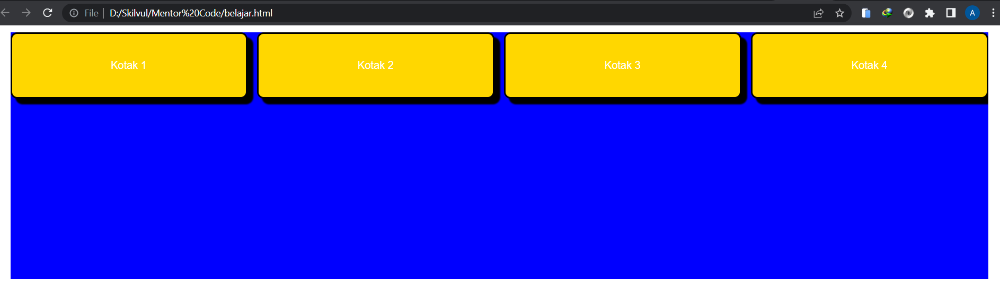
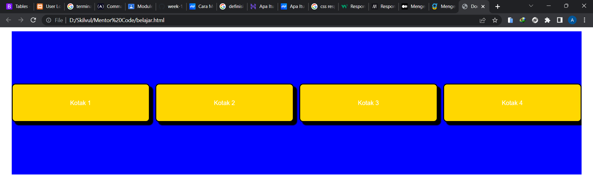
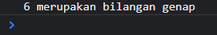

# Rangkuman Week 1

## Unix Command Line

- ### Shell

  Shell merupakan user interface yang mengelola CLI dan berperan sebagai perantara yang menghubungkan user dan sistem operasi. Shell bertugas untuk memproses semua perintah yang diketik di CLI.

- ### CLI (Command Line Interface)

  CLI adalah singkatan dari Command Line Interface. Singkatnya, dengan CLI sebagai program, pengguna bisa memberikan perintah dalam bentuk teks, kemudian memberikan instruksi dan melakukan tugas tertentu.

- ### Terminal

  Terminal adalah interface di mana Anda bisa mengetikkan baris-baris perintah berbasis teks untuk sistem operasi Linux

- ### File System Structure

  file system adalah sebuah proses yang mengatur di mana dan bagaimana sebuah data disimpan dan diakses dalam disk penyimpanan.

  

- ### Command
  - **pwd**, untuk melihat current working directory
  - **cd**, untuk pindah ke directory lain
  - **dir**, untuk melihat directory
  - **mkdir**, untuk membuat sebuah folder/directory
  - **ls**, untuk melihat isi konten di dalam directory
  - **touch**, untuk membuat sebuah file
  - **cp**, untuk menyalin sebuah file
  - **mv**, untuk memindahkan file dan mengubah nama file
  - **rm**, untuk menghapus suatu file

## Git & Github

- ### Perbedaan Git & Github

  - #### Git
    Git merupakan software berbasis Version Control System (VCS) yang bertugas untuk mencatat perubahan seluruh file atau repository suatu project.
  - #### Github
    GitHub merupakan layanan cloud yang berguna untuk menyimpan dan mengelola sebuah project yang dinamakan repository (repo git).

- ### Mengapa Git & Github wajib digunakan

  Git & Github menjadi tools yang wajib digunakan oleh seorang programmer, karena dapat memudahkan programmer dalam menyimpan perubahan yang terjadi pada projek yang sedang dibuat, dan dengan tools ini memudahkan programmer untuk bekerja sama dalam sebuah tim.

- ### Alur Kerja Git & Github

  - #### Membuat Repository

    kita dapat membuat repository dengan perintah dibawah ini :

    ```
    git init <directory>
    ```

    kita mengetikkan perintah git init dan pilih directory tujuan yang ingin dibuat repositori.

  - #### Add and Commit
    Perubahan yang diajukan atau file tambahan akan di tambahkan ke index dengan menggunakan perintah add. Untuk menambahkan file, perintahnya :
    ```
    git add <file_name>
    ```
    **Commit** berfungsi untuk menambahkan update file serta komentar. Jadi setiap kontributor bisa memberikan konfirmasi update file di proyek yang sedang dikerjakan. Masukkan perintah berikut untuk membuat Commit :
    ```
    git commit -m "this is my commit"
    ```
  - #### Publish file ke github

    untuk mengirim/publish file ke github yaitu dengan mengetikkan perintah :

    ```
    git push -u origin master
    ```

  - #### Clone repository
    untuk menyalin/clone repository yang ada di github ke file lokal komputer kita, yaitu dengan mengetikkan perintah :
    ```
    git clone <url>
    ```

## HTML

- #### Definisi HTML

  **HTML** (Hypertext Markup Language) adalah bahasa markup yang digunakan untuk membuat halaman website. Isinya terdiri dari berbagai kode yang dapat menyusun struktur suatu website.

  Dengan adanya HTML, pengguna dapat membuat atau menyusun heading, paragraf, gambar, link, dan lainnya supaya dapat dilihat banyak orang melalui halaman website.

  Untuk bisa diakses secara umum, pengguna perlu membukanya lewat aplikasi browser, seperti Internet Explorer, Chrome, atau Mozilla Firefox.

- #### Struktur HTML

  ```
  <html>
    <head>
      <title> // judul </title>
    </head>
    <body>
      // isi konten html
    </body>
  </html>
  ```

  sintaks diatas ini merupakan struktur sederhana untuk membuat sebuah halaman html, pada bagian head biasanya terdapat tag **title** untuk memberikan judul pada halaman html, selain itu bisa ditambahkan tag **link** untuk menghubungkan dengan file css. pada bagian **body** biasanya akan diisi dengan konten yang ingin ditampilkan pada web tersebut.

- #### Tag HTML

  Tag adalah tanda awalan dan akhiran dalam perintah HTML yang akan dibaca oleh web browser. Tag dibuat dengan menggunakan kurung siku <>, di mana di dalamnya berisi nama tag.

  Setiap tag memiliki fungsi perintah yang berbeda-beda. Mulai dari membuat judul, paragraf, heading, cetak tebal, miring, italic, dan lainnya.

  Tag dibagi menjadi 2, yaitu :

  - ##### Single Tag
    Tag yang tidak memiliki penutup tag
    ```
    
    ```
  - ##### Double Tag
    Tag yang memiliki penutup tag
    ```
    <h1> This is heading 1 </h1>
    ```

  ##### Contoh Tag HTML

  - ##### Membuat tulisan tebal dan miring

    ```
    <b>tulisan tebal</b>
    <i>tulisan miring</i>
    ```

  - ##### Heading

    ```
    <h1>Heading 1</h1>
    <h2>Heading 2</h2>
    ```

  - ##### Membuat artikel/paragraf

    ```
    <p>paragraff</p>
    ```

  - ##### Untuk menghubungkan ke file css

    ```
    <link rel="stylesheet" src=""/>
    ```

  - ##### Membuat sebuah tombol

    ```
    <button>ini tombol</button>
    ```

  - ##### Untuk menampilkan gambar

    ```
    
    ```

- #### Semantic HTML

  Elemen semantik adalah elemen-elemen yang menyatakan makna atau tujuan dari elemen itu sendiri. misal pada tag **header** dibuat untuk membentuk elemen html spesifik pada bagian header. Salah satu keuntungan menggunakan elemen semantik adalah dokumen HTML kita akan mudah dibaca, baik itu oleh manusia maupun mesin.

  ##### Contoh tag semantic

  - `<header>`
  - `<nav>`
  - `<main>`
  - `<article>`
  - `<footer>`
  - `<aside>`

- #### Deploy HTML
  **Deploy** adalah sebuah proses untuk mempublish aplikasi yang sudah kita kerjakan supaya bisa diakses oleh orang lain. Orang lain tidak dapat mengakses web yang kita buat jika belum di deploy karena file web kita masih berada di file lokal. Untuk itu, kita bisa melakukan deploy menggunakan netlify.

## CSS

- #### Definisi CSS

  CSS adalah singkatan dari cascading style sheets, yaitu bahasa yang digunakan untuk menentukan tampilan dan format halaman website. Dengan CSS, Anda bisa mengatur jenis font, warna tulisan, dan latar belakang halaman.

- #### Penggunaan CSS

  - ##### Inline CSS
    kode css yang disisipkan pada atribut html, contohnya :
    ```
    <h1 style="color: green;">Hello World</h1>
    ```
  - ##### Internal CSS
    kode css yang disisipkan dengan menggunakan tag `<style>` didalam tag `<head>`
    ```
    <!DOCTYPE html>
    <html>
      <head>
        <title>My Web</title>
        <style>
          * {
            margin: 0;
            padding: 0;
          }
          h1 {
            color: black;
          }
        </style>
      </head>
      <body>
        <h1>Hello guys</h1>
      </body>
    </html>
    ```
  - ##### Eksternal CSS

    file html dengan css dibuat terpisah, untuk menghubungkan file css ke dalam html bisa dengan memberikan tag `<link>` pada bagian `<head>`

    ```
    <!-- index.html -->
    <!DOCTYPE html>
    <html>
      <head>
        <title>My Web</title>
        <link rel="stylesheet" href="style.css" />
      </head>
      <body>
        <h1>Hello guys</h1>
      </body>
    </html>
    ```

    ```
    <!-- style.css -->
    * {
      margin: 0;
      padding: 0;
    }
    h1 {
      color: black;
    }
    ```

- #### CSS Syntax

  Syntax yang digunakan untuk menunjuk/menyeleksi elemen html yang akan diberi style. CSS Syntax dibagi menjadi 3 bagian, yaitu **selector**, **property**, dan **value**. Untuk selector ada 3, yaitu :

  ```
  <!-- selector by tag -->
  h1 {
  }

  <!-- selector by class -->
  .title{
  }

  <!-- selector by id -->
  #title{
  }
  ```

  Contoh Syntax CSS :

  ```
  p {
    color: green;
  }
  ```

  Penjelasan

  - Kita menyeleksi terlebih dahulu elemen yang akan diberi style, disini kita akan memberi style pada tag `<p>`
  - Disini kita akan memberikan style untuk mengubah warna teks pada elemen yang sudah diseleksi, yaitu dengan memberikan property `color`
  - Kemudian kita memberikan `value`, disini kita memberikan value nya green, jadi nanti teks yang ditampilkan akan memberikan output warna hijau.

- #### CSS Responsive
  **Responsive Web** adalah tampilan website yang bisa menyesuaikan dengan device pengguna. Untuk membuat sebuah web menjadi responsive kita harus mengatur ukuran layar pada tiap device. setelah itu kita menentukan layout sesuai dengan ukuran layarnya. Kita dapat mengatur responsive dengan menggunakan **Media Query**
  ```
  @media screen and (min-width: 800px) {
    .container {
      margin: 1em 2em;
    }
  }
  ```
- #### CSS Flexbox

  Flexbox merupakan mode layout yang ada di CSS3 dan digunakan untuk mengatur elemen di suatu halaman web.
  **Contoh implementasi flexbox :**

  ```
  <!-- kode html -->
  <!DOCTYPE html>
  <html lang="en">
  <head>
      <meta charset="UTF-8">
      <meta http-equiv="X-UA-Compatible" content="IE=edge">
      <meta name="viewport" content="width=device-width, initial-scale=1.0">
      <title>Document</title>
      <link rel="stylesheet" href="style.css">
  </head>
  <body>
    <main>
        <div class="kotak">
            <h1>Kotak 1</h1>
        </div>
        <div class="kotak">
            <h1>Kotak 2</h1>
        </div>
        <div class="kotak">
            <h1>Kotak 3</h1>
        </div>
        <div class="kotak">
            <h1>Kotak 4</h1>
        </div>
    </main>
  </body>
  </html>
  ```

  ```
  <!-- kode css -->

  * {
  margin: 0;
  padding: 0;
  font-family: Arial, Helvetica, sans-serif;
  }

  main {
    display: flex;
    gap: 15px;
    overflow: hidden;
    background-color: blue;
    height: 50vh;
    margin: 10px 30px 10px 30px;
  }

  .kotak {
    width: 50%;
    height: 100px;
    border: 3px solid black;
    box-shadow: 8px 8px 2px 1px black;
    border-radius: 10px;
    display: flex;
    color: white;
    background-color: gold;
    justify-content: center;
    align-items: center;
  }
  ```

  **Result**
  

  Untuk membuat elemen kotak tersebut berada ditengah, kita perlu menambahkan property `align-items` pada pembungkus kotak tersebut dan diberi value nya `center`. `align-items` biasanya digunakan untuk mengatur konten berdasarkan sumbu y / vertikal, sedangkan `justify-content` mengatur secara horizontal.

  **Result**
  

## Algoritma dan Struktur Data

- #### Definisi

  - **Algoritma**
    Algoritma adalah rangkaian terbatas dari instruksi-instruksi yang rumit, yang biasanya digunakan untuk menyelesaikan atau menjalankan suatu permasalahan tertentu.
  - **Struktur Data**
    Cara penyimpanan , pengorganisasian , dan pengaturan data di dalam media penyimpanan komputer sehingga data tersebut dapat digunakan secara efisien.

- #### Manfaat

  - **Algoritma**

    - Mempermudah dalam proses pembuatan program
    - Membantu untuk menyelesaikan suatu permasalahan
    - Mengatasi masalah yang ada secara berurutan

  - **Struktur Data**
    - Menyimpan dan mengatur data
    - Pertukaran data
    - Meningkatkan kualitas algoritma

- #### Penggunaan Algoritma

  - **Contoh Kasus**

    Hitunglah luas persegi panjang berikut, dengan panjang 8cm dan lebar 4 cm!

  - **Deskripsi penyelesaian**
    - Mulai
    - Deklarasi variabel **p** , **l** dan **luas**
    - Beri nilai p = 8 dan l = 4
    - Lakukan proses `luas = p * l`
    - Output **luas**
    - Stop

- #### Implemmentasi pada bahasa pemrograman

  - **Contoh Kasus**

    Cek bilangan yang di inputkan apakah termasuk bilangan ganjil atau genap!

  - **Source Code**

    ```
    function ceknomor(x) {
      if(x % 2 == 0){
        console.log(x, 'merupakan bilangan genap')
      } else{
        console.log(x, 'merupakan bilangan ganjil')
      }
    }
    ceknomor(prompt('masukkan angka'))
    ```

  - **Result**

    
