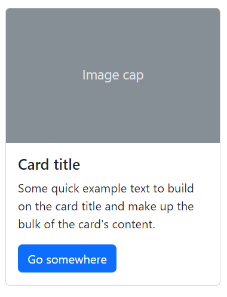

# Rangkuman Week 4

### Git & Github Lanjutan

#### Pengenalan

Git & Github merupakan suatu software yang biasa digunakan oleh developer untuk mengelola / mengerjakan projeknya, Terlebih lagi software ini sangat membantu developer jika ada projek team, jadi mempermudah para developer untuk membangun projeknya.

#### Perbedaan

- **Git**
  Git merupakan software berbasis Version Control System (VCS) yang bertugas untuk mencatat perubahan seluruh file atau repository suatu project.
- **Github**
  GitHub merupakan layanan cloud yang berguna untuk menyimpan dan mengelola sebuah project yang dinamakan repository (repo git). Cara kerja pada GitHub harus terkoneksi pada internet sehingga tidak perlu meng-install sebuah software ke dalam perangkat keras.

#### Alur Kerja

Terlebih dahulu kita harus membuat sebuah repositori baru di github. Kemudian kita inisialisasi projek kita dengan menggunakan perintah `git init`. Selanjutnya kita akan menambahkan file/folder dengan perintah `git add`
contoh :
`git add my-directory`
jika ingin menambahkan semua file yang ada di direktori tersebut bisa dengan menggunakan
`git add .`
setelah itu, kita melakukan commit pada file yang sudah ditambahkan dengan menggunakan perintah `git commit`
contoh :
`git commit -m "first-commit"`
untuk berpindah branch kita bisa menggunakan perintah `git branch`
contoh :
`git branch -M main`
setelah melakukan commit kita harus me-remote ke repo github
`git remote [link]`
langkah terakhir kita tinggal push saja ke github dengan menggunakan perintah `git push`
contoh :
`git push -u origin main`

#### Git Branch

Git branch merupakan fitur yang wajib digunakan jika ingin berkolaborasi dengan developer atau berkerja tim.

Untuk menghindari conflict kita tidak boleh mengerjakan projek pada branch yang sama, setiap developer harus membuat branch nya sendiri. misal, developer 1 ingin membuat fitur login sedangkan developer kedua ingin mmembuat fitur regis, maka kedua nya harus memiliki branch nya sendiri.

untuk membuat branch kita bisa menggunakan `git branch <branch-name>` untuk berpindah branch kita bisa menggunakan `git switch <branch-name>` atau `git checkout <branch-name>`, jika kita ingin menghapus suatu branch kita bisa menggunakan `git branch -d <branch-name>`

#### Git Merge

suatu command dalam git untuk membuat branch yang bercabang menjadi satu kembali atau dengan kata lain mengintegrasikan kembali branch tersebut menjadi satu. langkahnya :

- pindah ke branch master dahulu
  `git switch master`
- kemudian merge
  `git merge login-form`

### Responsive Web & Bootstrap

#### Responsive Web Design

Responsive web design adalah sebuah metode bagi web developer untuk membuat suatu layout website yang dapat menyesuaikan diri sesuai dengan ukuran layar pengguna.

Baik dari ukuran huruf, user interface, gambar dan tata letak akan menyesuaikan dengan lebar layar dan resolusi device yang digunakan. Device yang umumnya digunakan yaitu PC, tablet dan Hp.

Para developer bisa menggunakan tools untuk mempermudah dalam proses development website, Tools yang digunakan yaitu `mobile simulator` , disini kita bisa melihat tampilan website kita untuk ukuran hp, tablet maupun pc.

#### Viewport

Dengan menggunakan tag `<meta name='viewport'>` kita bisa mengatur viewport sesuai kebutuhan.
contoh :
`<meta name="viewport" content="width=device-width, initial-scale=1">`

#### Relative CSS Unit

**CSS Unit**
CSS unit adalah satuan untuk menentukan ukuran dari suatu elemen atau kontennya. Misal, jika ingin menentukan `font-size` dari sebuah paragraf, kita bisa memberikan nilai tertentu. Nilai ini akan diikuti oleh satuan (CSS unit).
contoh :

```
p {
    font-size : 20px;
}
```

**Relative Unit**
Relative unit berguna untuk mendesain website yang responsif karena ukurannya bisa berubah relatif terhadap parent atau ukuran layar.

Secara umum relative unit bisa dipakai sebagai satuan bawaan website responsif sehingga bisa membantu untuk meng-update style di ukuran layar yang berbeda.

contoh :

- % (relative terhadap parent elemen)
- em (relatif terhadap font-size dari elemen saat ini)
- rem (relatif terhadap font-size root elemen `<html>`)
- vh (relatif terhadap tinggi viewport)
- vw (relatif terhadap lebar dari viewport)

#### Media Query

Media query merupakan modul CSS3 yang berguna membuat layout kita responsive dengan menyesuaikan tampilan berdasarkan ukuran layar perangkat.

Media query juga disebut dengan Breakpoint, karena cara kerja media query yakni dengan cara mengecheck ukuran viewport apakah sesuai dengan kondisi yang kita deklarasikan, jika benar maka kode dalam kondisi tersebut yang akan dieksekusi.

untuk memberikan breakpoint nya kita bisa menggunakan `min-width` maupun `max-width`, disesuaikan saja sesuai dengan kebutuhannya

```
@media only screen and (max-width: 600px) {
  .about{
    font-size: 20px;
    background-color: blue;
  }
}
```

cara bacanya yaitu jika pada ukuran layar maksimal 600 piksel maka `class about` akan menampilkan `font-size: 20px dan background-color: blue`, jika ukuran layar lebih dari 600 piksel, maka code tersebut tidak dieksekusi.

#### Bootstrap

Bootstrap adalah framework web development berbasis HTML, CSS, dan JavaScript yang dirancang untuk mempercepat proses pengembangan web responsive dan mobile-first (memprioritaskan perangkat seluler). Selain bisa digunakan untuk mengembangkan website dengan lebih cepat, Bootstrap adalah framework gratis yang bersifat open-source. Skrip dan syntax yang disediakan Bootstrap bisa diterapkan untuk berbagai komponen dalam desain web. untuk menggunakan bootstrap kita bisa menyisipkan link css dan js di dokumentasi bootstrap.

**Layout**
Dengan menggunakan bootstrap kita lebih mudah dalam melakukan layouting pada web yang sedang kita buat, ada beberapa breakpoint pada bootstrap, antara lain :

- extra small `<576px`
- small `>=576px`
- medium `>=768px`
- large `>=992px`
- extra large `>=1200px`
- extra extra large `>=1400px`

pada sistem layouting pada bootstrap kita bisa menambahkan `container` pada website kita, misal nya kita akan menambahkan container dengan breakpoints medium yaitu dengan menambahkan `container-md`. container ini akan muncul ketika ukuran layar sama dengan atau melebihi breakpoint medium. Selain itu kita juga bisa menggunakan sistem grid lebih mudah dengan menggunakan bootstrap.

**Component**
Dengan menggunakan bootstrap kita lebih mudah dan cepat dalam mendevelop web projek kita, karena bootstrap sudah menyediakan komponen nya secara lengkap, antara lain ada navbar, button, alert, card, modals, dan lainnya. Kita hanya tinggal membuka dokumentasi pada bootstrap dan meng-copy komponen yang kita inginkan.

contoh :
**Komponen Card**



```
<div class="card" style="width: 18rem;">
  
  <div class="card-body">
    <h5 class="card-title">Card title</h5>
    <p class="card-text">Some quick example text to build on the card title and make up the bulk of the card's content.</p>
    <a href="#" class="btn btn-primary">Go somewhere</a>
  </div>
</div>
```
