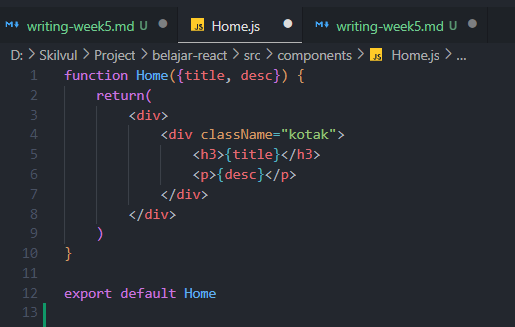
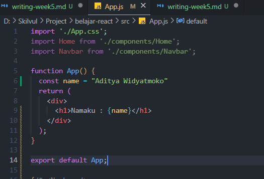
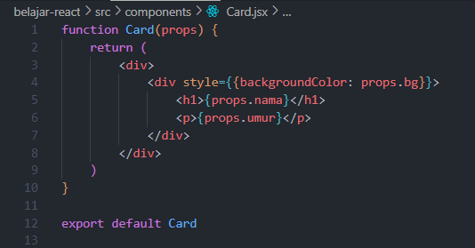
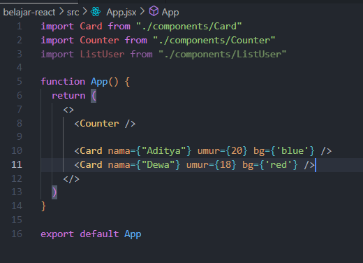
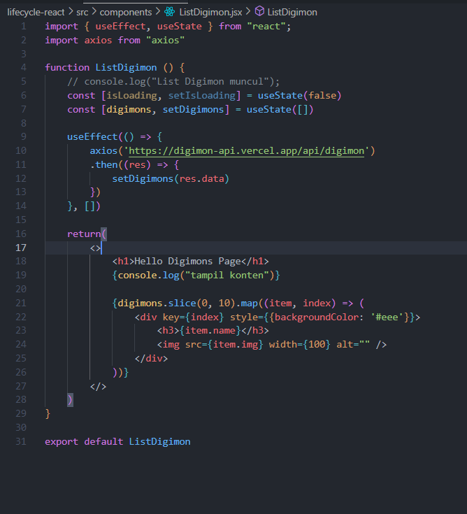

# Rangkuman Week 5

## React Dasar

### Apa itu **React JS** ?

React JS adalah library JavaScript yang biasa digunakan saat membangun UI suatu website atau aplikasi web.

React JS bisa dianggap seperti perpustakaan yang berisi berbagai kode JavaScript yang sudah tertulis. Anda tinggal mengambil kode yang ingin Anda gunakan. Sehingga, ini membuat proses coding menjadi lebih efisien dengan framework JavaScript tersebut.

> React JS is **FAST**

Dengan menggunakan react kita bisa membangun UI pada suatu web dengan cepat dan dapat me-render pada bagian frontEnd menjadi lebih cepat walaupun harus menghandle berbagai data.

> React JS is **MODULAR**

Kita dapat menerapkan konsep Modular Javascript pada React JS. React JS dapat membagi 1 tampilan pada website menjadi beberapa komponen.

> React JS is **POPULER**

React JS adalah salah satu library yang sangat populer. Saat ini ada lebih dari satu juta website yang sudah menggunakannya. Komunitas React JS di seluruh dunia sangat besar, Kebanyakan perusahaan teknologi sudah menggunakan React JS.

### Instalasi React JS

Step yang harus dilakukan untuk install React :

- Install Node JS

  Step pertama kita harus menginstall Node JS terlebih dahulu, jika sudah selesai menginstall node kita bisa mengecek versi node yang sudah terinstall pada terminal dengan perintah `node -v`

- Buat Projek React

  Setelah selesai menginstall node nya, kemudian kita buat projek react dengan perintah `npx create-react-app my-app`. Kita tunggu sampai proses download nya selesai, kemudian untuk menjalankan aplikasi React nya yaitu dengan perintah `npm start`. Selain itu ada alternatif lain untuk membuat projek react dengan lebih cepat, yaitu dengan menggunakan `Vite`, untuk perintah nya seperti ini : `npm create vite@latest my-react-app --template react`

### Component React JS

Pada React JS untuk menyusun UI Element nya dengan di pisah per komponen nya, seperti komponen Navbar, Card, Form, Footer dan lainnya. React JS bekerja dengan Virtual DOM. Di dalam Virtual DOM ini kita harus membuat komponen untuk memberitahu React tentang apa saja yang harus ditampilkan (render) ke Real DOM (HTML).

Contoh Komponen React



Ada 2 cara untuk membuat component pada React JS

- Class component
- Function Component

Untuk saat ini dalam membuat sebuah komponen pada React JS yang lebih sering digunakan yaitu **Function Component**, untuk **Class Component** sudah jarang digunakan lagi.

### Virtual DOM

Ketika Developer mengupdate DOM dengan menggunakan JSX, React JS akan membuat Virtual DOM, yaitu salinan dari DOM asli yang ingin diupdate. Contohnya, Ketika menemukan bagian yang perlu diubah, React JS akan mengubah bagian itu saja. Jadi, pengguna tidak perlu reload satu halaman untuk melihat perubahannya. Hal ini dapat berpengaruh terhadap performa website. Karena setiap perubahan hanya dilakukan pada bagian yang diperlukan saja. Jika tidak menggunakan Virtual DOM, maka website akan menggunakan HTML untuk update DOM. Sehingga, seluruh DOM nya mesti direload untuk menampilkan perubahan di satu bagian.

### JSX

JSX adalah extension syntax JavaScript yang memungkinkan Anda untuk memodifikasi Document Object Model (DOM) dengan kode seperti HTML. JSX dapat mempermudah untuk menambah konten dinamis. Karena extension ini dapat membantu untuk memasukkan syntax bergaya HTML ke dalam DOM. Browser tidak bisa secara langsung menampilkan JSX, maka prosesnya JSX dicompile terlebih dahulu menjadi file Javascript, kemudian baru bisa ditampilkan oleh browser.

- JSX hanya memiliki 1 parent element, jika lebih dari itu maka akan muncul pesan eror
- Untuk penamaan class pada JSX menggunakan `className` agak sedikit berbeda dari HTML
- Kita bisa menggunakan curly braces `{}` untuk menyisipkan sintaks Javascript
- Untuk mengakses value pada suatu variable kita bisa menggunakan curly braces `{}`
  
- Untuk Atribut dan Event sama seperti variable, kita bisa mengaksesnya dengan menggunakan curly braces `{}`

### Props & State

**Perbedaan Props dan State**

- Props memiliki arti properties yang berfungsi untuk menangkap data dari state, sedangkan state berfungsi untuk mengirim data.
- Props diteruskan ke komponen (mirip dengan function parameters) sedangkan state dikelola dalam komponen
- Props digunakan agar komponen memiliki data yang dinamis yang dikirim dari komponen lain

**contoh props**



**contoh state**



### LifeCycle Method

Setiap React Component akan melewati 3 fase :

- **Mount**
  Fase saat komponen dibuat dan ditambahkan ke DOM

- **Update**
  Fase dimana component di-render ulang karena perubahan props dan state

- **UnMount**
  Fase saat komponen dihapus dari DOM

List Data



Untuk step pertama kita membuat useState yang nantinya digunakan untuk menampung datanya ke dalam variabel **digimons**, kemudian untuk **setDigimons** berfungsi untuk merubah data. Untuk useEffect nya mengambil data dari API, kemudian di set ke dalam variabel **digimons**, jika data nya sudah berhasil diload semua, maka akan muncul semua datanya.

### Styling React

Untuk menambahkan styling kita bisa menggunakan file CSS dengan cara `import`. selain itu, kita juga bisa memberikan Inline CSS. contoh nya seperti ini :

```
style={{backgroundColor: 'blue'}}
```

untuk penulisan property nya di tulis camel case. kita bisa mengatur styling dengan mudah menggunakan Framework Bootstrap. Untuk penggunaan nya, kita copy link dari dokumentasi Bootstrap ke dalam file HTML kita.
